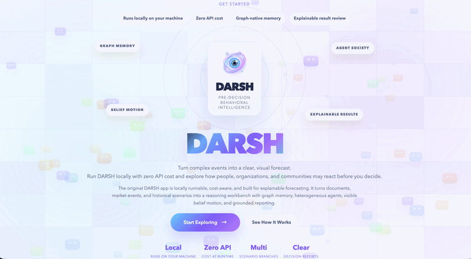
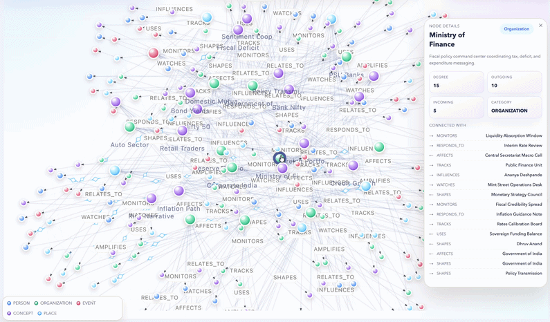
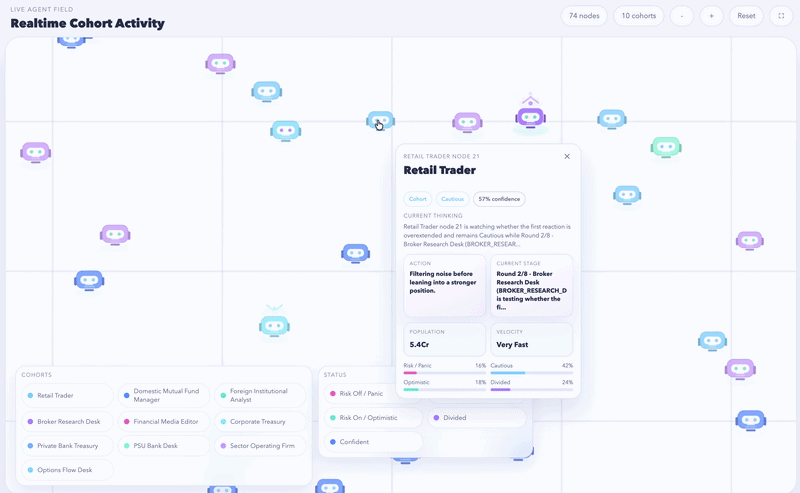
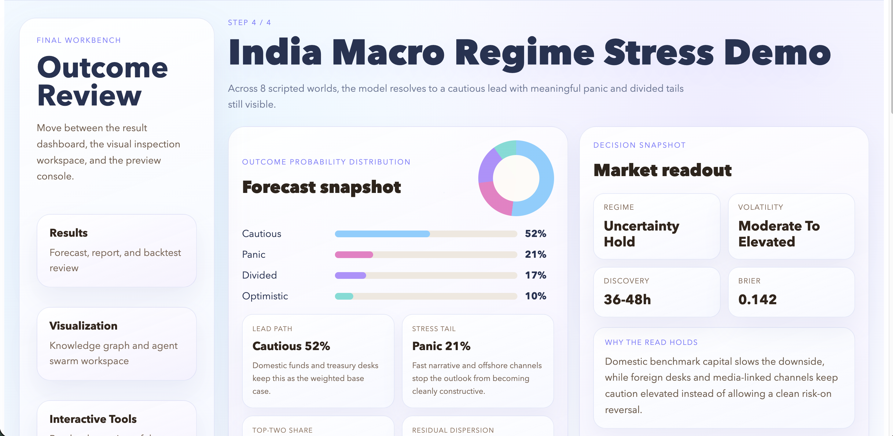

# DARSH

<p align="center">
  
</p>

<p align="center">
  <strong>Pre-Decision Behavioral Intelligence</strong>
</p>

<p align="center">
  Understand how people, markets, and institutions are likely to move before decisions lock the future in place.
</p>

<p align="center">
  <strong>Graph-native, local-first, zero-paid-API multi-agent reasoning for forecasting reactions, narratives, markets, and institutional behavior.</strong>
</p>

<p align="center">
  DARSH turns raw documents, live developments, and historical events into an inspectable reasoning system:
  <br />
  knowledge graph, causal structure, heterogeneous agents, belief motion, calibrated outcomes, and grounded reports.
  <br />
  When paired with local models through Ollama, the full original app can run on your machine without mandatory cloud inference spend.
</p>

<p align="center">
  
  
  
  
  
  
  
</p>

<p align="center">
  <a href="https://darsh-demo.indramandal85.workers.dev/"></a>
</p>

> [!IMPORTANT]
> Try the live DARSH demo here: **[https://darsh-demo.indramandal85.workers.dev/](https://darsh-demo.indramandal85.workers.dev/)**  
> If you want the fastest feel for the product, start with the demo before exploring the full local-first app workflow.

---

## Overview

DARSH is a full-stack reasoning workbench designed for situations where a single answer is not enough.

Instead of producing one opaque prediction, DARSH:

- extracts entities and relationships from source material
- builds a navigable knowledge graph
- derives causal structure where available
- simulates multiple agent types with different behavioral styles
- tracks belief movement across rounds and branches
- aggregates outcomes into a probability distribution
- scores historical forecasts with Brier-based backtesting
- produces grounded reports and interactive result surfaces
- stays compatible with a local-first workflow powered by Ollama instead of requiring a paid cloud inference API

This repository includes:

- the **original DARSH app** for real end-to-end runs with local LLM inference
- the **DARSH demo app** for a polished walkthrough and presentation-ready experience

---

## Why Teams Try DARSH First

- **Runs locally** so sensitive exploration can stay on your machine instead of leaving your workstation by default.
- **Zero paid API cost at runtime** when you use local models through Ollama, which makes repeated experimentation practical.
- **Inspectable reasoning** through graph memory, agent disagreement, belief motion, and grounded reporting instead of a single opaque answer.
- **Decision-ready review surfaces** that combine the graph, swarm, report, and scoring layers in one place.

---

## Product Preview

### Front Page

The landing experience introduces the full DARSH workflow with a premium product-style welcome page, guided entry points, and a visual identity that frames the graph, agent, and results pipeline before a run begins.



### Knowledge Graph

DARSH converts scenario text into a dense, explorable relationship map with active-focus signaling, labeled edges, fullscreen support, and zoom-aware layout controls.



### Live Swarm

DARSH visualizes population-weighted cohort movement as a live agent field, showing influence, communication, active senders, receivers, and evolving collective attention.



### Final Results Surface

The final review layer combines forecast outputs, visual inspection, interactive analysis, backtest scoring, and exports into a structured decision workspace.



---

## What DARSH Is Built To Do

### 1. Turn unstructured context into machine-readable reasoning state

DARSH ingests:

- uploaded text documents
- live news topic fetches
- historical dossiers for backtesting

It then extracts entities, relationships, and context cues to form a graph-native memory layer instead of relying only on prompt text.

### 2. Simulate heterogeneous actors instead of one generic model voice

DARSH supports a mixed agent society with distinct behavioral styles, including:

- rational
- emotional
- tribal
- contrarian
- institutional

These agents do not simply paraphrase each other. They reason with different tendencies, memory traces, and influence behavior.

### 3. Model belief movement, not just final labels

The system tracks probabilistic belief states such as:

- `panic`
- `cautious`
- `optimistic`
- `divided`

Beliefs evolve over rounds and branches, which makes the final forecast inspectable rather than magical.

### 4. Support counterfactual and causal interpretation

DARSH separates the knowledge graph layer from the causal reasoning layer.

When causal structure is available, the system can map directional effects and support “what changed what” style reasoning rather than only descriptive summaries.

### 5. Produce review-ready outputs

DARSH ends in a professional results surface with:

- forecast distribution
- knowledge graph explorer
- population-weighted swarm visualization
- grounded report output
- historical backtest scoring
- interactive follow-up analysis
- markdown and PDF exports

---

## Core Capabilities

### Graph and memory layer

- Document chunking and extraction pipeline
- Entity validation and fuzzy deduplication
- Relationship extraction and graph construction
- Chroma-backed graph memory indexing
- Graph save/load, history, and merge support

### Agent and simulation layer

- Heterogeneous agent factory
- Bayesian-style belief updating
- Per-agent semantic memory
- Social influence and communication flow
- Parallel branch execution for probability distributions
- SQLite-backed simulation logging

### Analysis and evaluation layer

- Grounded multi-section report generation
- Historical event backtesting
- Brier score evaluation
- Calibration tracking
- Market impact and population weighting views

### Product and interface layer

- Original app with full pipeline execution
- Demo app with guided walkthrough
- Interactive knowledge graph
- Live swarm field
- Final results workbench
- Interactive tools and grounded follow-up prompts

---

## How DARSH Works

```text
Document / Live News / Historical Event
                ↓
      Parsing + Chunking + Extraction
                ↓
      Validated Knowledge Graph Memory
                ↓
     Optional Causal DAG + Counterfactual Layer
                ↓
   Multi-Agent Society + Belief Update Dynamics
                ↓
     Parallel Simulation Across Branches/Rounds
                ↓
       Aggregation + Backtest + Report Engine
                ↓
  Visualization Workbench + Interactive Review
```

### Five deliberate moves

1. **Ingest the scenario**  
   Start with a report, event, briefing, or historical context document.

2. **Build graph memory**  
   Extract entities and relations into a structured world model.

3. **Simulate heterogeneous actors**  
   Run multiple agent types through rounds, branches, and social influence.

4. **Track belief motion**  
   Watch conviction shift across outcomes instead of hiding the reasoning path.

5. **Review the final workbench**  
   Inspect the graph, swarm, report, and scoring in one result surface.

---

## Why DARSH Is Different

DARSH is built around a simple idea:

> high-stakes prediction should be visible, inspectable, and revisable.

That means the project emphasizes:

- **local-first inference** instead of mandatory paid cloud APIs
- **structured graph memory** instead of pure context-window dependence
- **multi-agent disagreement** instead of one flattened answer
- **belief distributions** instead of false certainty
- **historical scoring** instead of unmeasured claims
- **visual explanation** instead of hidden internal state

---

## Original App vs Demo App

### Original app

The original app is the full working pipeline.

Use it when you want:

- real document upload
- live news ingestion
- historical event loading
- knowledge graph generation
- full simulation execution with Ollama
- backtest scoring and grounded report output

Entry point:

- `app.py`

### Demo app

The demo app is a presentation-focused experience with curated states and a polished walkthrough.

Use it when you want:

- a guided product story
- fast preview of the workflow
- design and visualization review
- portfolio/demo presentation

Entry point:

- `app_demo.py`

---

## Quick Start

### Prerequisites

- Python `3.10+`
- Node.js `18+`
- Ollama
- macOS or a compatible local environment for the current setup

If you run the original app with local models through Ollama, DARSH follows a local-first path and does not require a paid inference API key.

### One-time setup

```bash
git clone https://github.com/indramandal85/DARSH-The-Multi-Agent-Reasoning-Based-Prediction-System.git neuroswarm
cd neuroswarm

python3.10 -m venv .venv
source .venv/bin/activate
pip install -r requirements.txt

cd frontend
npm install
cd ..

ollama pull llama3.1
```

---

## Run The Original DARSH App

This is the full local-first workbench. With Ollama running locally, the original app can execute end to end without paid API calls.

### Terminal 1

```bash
ollama serve
```

### Terminal 2

```bash
cd /path/to/neuroswarm
source .venv/bin/activate
python app.py
```

### Terminal 3

```bash
cd /path/to/neuroswarm/frontend
npm run dev
```

Open:

```text
http://localhost:5173
```

Default local services:

- frontend: `http://localhost:5173`
- backend API: `http://localhost:5001`

---

## Run The DARSH Demo App

The demo app does not require live Ollama inference. It is the lightest zero-cost way to review the product flow, visuals, and results workbench.

### Build the frontend

```bash
cd /path/to/neuroswarm/frontend
npm run build
cd ..
```

### Start the demo server

```bash
cd /path/to/neuroswarm
source .venv/bin/activate
python app_demo.py
```

Open:

```text
http://localhost:5002
```

---

## Typical Workflow In The Original App

### 1. Choose an input source

- upload a `.txt` scenario document
- fetch live news around a topic
- load a historical event for blind backtesting

### 2. Build the knowledge graph

DARSH parses the text, extracts validated entities and relationships, and saves a graph artifact for inspection and reuse.

### 3. Configure the simulation

Set:

- topic
- initial situation
- per-round event progression
- number of agents
- number of branches
- number of rounds

### 4. Run the simulation

DARSH executes multiple branches, records agent behavior, updates world state, and aggregates the resulting belief distribution.

### 5. Review the result workbench

Inspect:

- forecast probabilities
- dominant outcome
- knowledge graph explorer
- population-weighted cohort field
- historical score, if applicable
- full report and interactive analysis tools

---

## Input Modes

### Manual upload

Best for:

- reports
- briefs
- research notes
- policy documents
- scenario writeups

### Live news mode

Best for:

- current events
- market narratives
- emerging public sentiment topics
- topical institutional reactions

### Historical backtest mode

Best for:

- validating system behavior
- measuring forecast quality
- comparing predicted vs actual outcomes
- calibrating confidence through Brier scoring

---

## Output Artifacts

DARSH writes structured outputs to the repository so runs are inspectable after the UI session.

### Key output directories

- `data/inputs/`  
  normalized source documents

- `data/graphs/`  
  saved knowledge graphs

- `data/simulations/`  
  SQLite logs for simulation runs

- `data/reports/`  
  generated markdown/PDF outputs and scoring artifacts

- `data/agent_memories/`  
  per-agent semantic memory stores

---

## Main System Modules

```text
api/          Flask routes for upload, graph build, simulation, history, merge, scoring, and chat
agents/       Agent types, belief state logic, semantic memory, and population construction
analysis/     Report engine, backtest engine, calibration, PDF export, and market analysis
causal/       Causal extraction and counterfactual reasoning
core/         LLM caller and base agent logic
frontend/     Vue app surfaces for the original app, demo app, graph viewer, and swarm canvas
knowledge/    Parsing, extraction, validation, graph building, ingestion, densification, and graph merge
simulation/   Environment, runner, social network, branch execution, and post-run chat helpers
data/         Inputs, graphs, simulations, reports, and historical event documents
tests/        Module and phase-level test coverage
```

---

## Tech Stack

| Layer | Technology |
| --- | --- |
| LLM | Ollama + Llama 3.1 |
| Backend | Python, Flask |
| Frontend | Vue 3, Vite |
| Graph | NetworkX |
| Vector / memory | ChromaDB |
| Embeddings | sentence-transformers |
| Simulation logging | SQLite |
| Analysis | scikit-learn, custom evaluation/report pipeline |

---

## Notable Features In The Current Build

- Local-first end-to-end runs
- Zero paid API cost when paired with local models through Ollama
- Dual app surfaces: full app and guided demo
- Premium knowledge graph and live swarm visualization
- Fullscreen graph and swarm panels
- Historical simulation history and replay support
- Graph merge utilities
- Interactive post-run analysis tools
- Markdown and PDF report export
- White / violet / blue DARSH brand system across both apps

---

## Documentation

- Full run instructions: [RUNNING.md](./RUNNING.md)
- Additional usage notes: [use.txt](./use.txt)

---

## Contact

- LinkedIn: <https://www.linkedin.com/in/indra-mandal007>
- GitHub: <https://github.com/indramandal85>

---

## License

This repository currently does **not** include a standalone license file.  
If you plan to distribute or open-source it publicly, add a `LICENSE` file before release.
